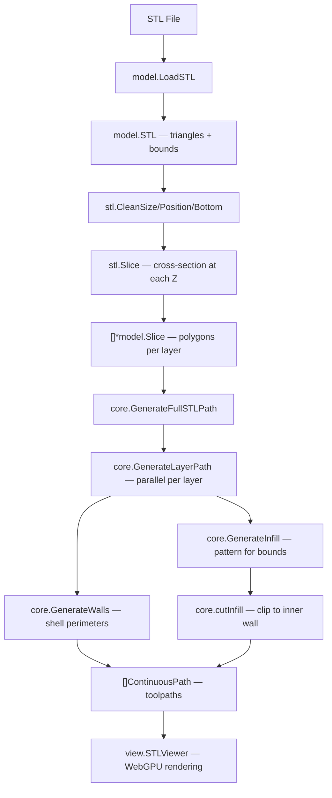

# Slicer Architecture

## Overview

Browser-based 3D print slicer written in Go with a WebGPU viewer frontend. Loads STL files, slices them into layers, generates toolpaths (walls, infill, skirt/brim), and renders them in-browser.

## Directory Structure

```
slicer/
├── slicer.go              # Root package — Slicer struct (entry point)
├── model/                 # Data types & STL processing
│   ├── vector.go          # Vector3 — 3D point/vector operations
│   ├── line.go            # LineSegment — intersection, distance
│   ├── triangle.go        # Triangle — normal, area, slicing
│   ├── polygon.go         # Polygon — offset, contains, rotate, bounds
│   ├── slice.go           # Slice — layer polygons from STL cross-sections
│   ├── sliceConfig.go     # SliceConfig — all slicer parameters
│   ├── path.go            # ContinuousPath, PathSegment — toolpath types
│   ├── stl.go             # STL loading (binary/ASCII)
│   ├── stlClean.go        # Mesh repair (bounds, position, bottom)
│   ├── stlCollapse.go     # Vertex merging / dedup
│   └── stlPrint.go        # STL debug printing
├── core/                  # Toolpath generation algorithms
│   ├── full.go            # GenerateFullSTLPath — orchestrates all paths
│   ├── layer.go           # GenerateLayerPath + cutInfill — per-layer paths
│   ├── wall.go            # GenerateWalls — perimeter/shell generation
│   ├── infill.go          # Infill patterns (line, grid, gyroid, etc.)
│   └── skirt.go           # Skirt/brim generation
├── handler/               # HTTP handlers
│   └── viewer.go          # ViewerHandler — HandleView, HandleSlice
├── view/                  # Frontend
│   ├── viewer.templ       # Templ templates (STLViewer, SlicerSidebar)
│   ├── viewer_templ.go    # Generated Go from .templ
│   └── viewer.js          # WebGPU renderer (STL mesh + print paths)
├── helper/                # Utilities
│   └── util.go            # General helper functions
└── example/               # Demo
    ├── viewer/main.go     # HTTP server entry point (chi router, port 4000)
    ├── Stanford_Bunny_sample.stl
    └── Eiffel_tower_sample.STL
```

## Data Flow



## Key Types

| Type | Package | Purpose |
|------|---------|---------|
| `Slicer` | `slicer` | Top-level orchestrator: config + model |
| `STL` | `model` | Loaded mesh: triangles, bounds, slices |
| `SliceConfig` | `model` | All slicer parameters |
| `Slice` | `model` | One layer: Z height + polygons |
| `Polygon` | `model` | Closed 2D contour (shell or hole) |
| `ContinuousPath` | `model` | Ordered list of PathSegments |
| `PathSegment` | `model` | Start→End line (travel or extrusion) |
| `ViewerHandler` | `handler` | HTTP: GET `/` + POST `/slice` |

## Frontend Architecture

- **Template engine**: `templ` generates Go code from `.templ` files
- **HTMX**: POST `/slice` swaps only `#sidebar-container` — preserves WebGPU canvas
- **WebGPU viewer** (`viewer.js`):
  - STL mesh pipeline: vertex+normal buffers, Phong-lit shader
  - Print path pipeline: triangle-strip thick lines with miter joins
  - Travel lines rendered thin (0.15× width), extrusion lines full width
  - Orbit camera with mouse drag/scroll zoom

## Concurrency

- `GenerateFullSTLPath` processes layers in parallel via goroutines + `sync.WaitGroup`
- Each layer's walls + infill are generated independently
- Results collected into a mutex-protected shared slice, then sorted by layer index
